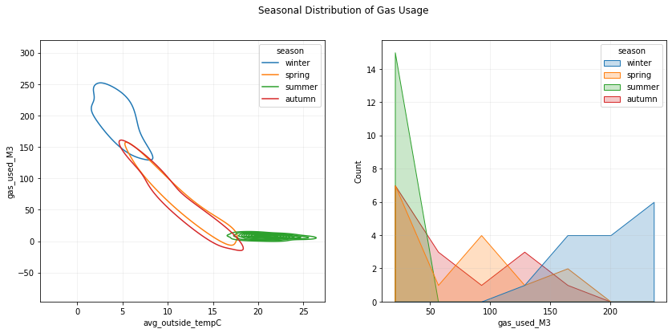
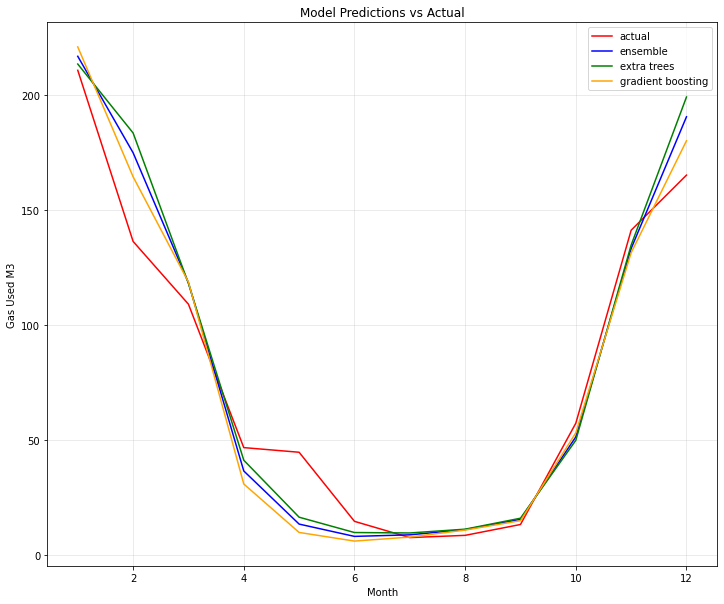
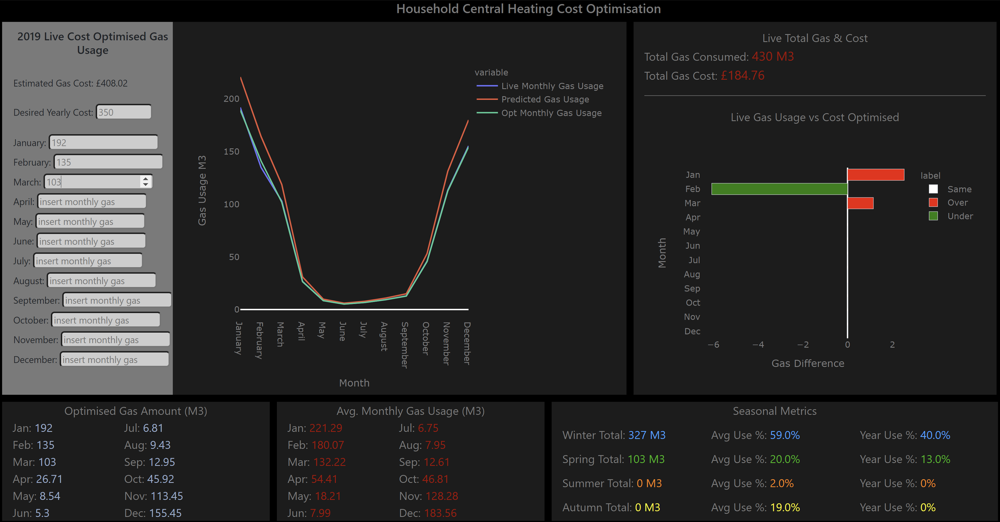

# Household Gas Usage Forecast & Optimisation App
## Introduction
No one likes the surprise of opening their latest energy bill to find that the cost is increasing because the latest energy readings show a rise in consumption. This all being a common scenario, but if we can leverage the data of our past gas consumption then we can gain the ability to stay on top of the amount of future gas we use (providing the non occurence of black swan events e.g. a blistering heatwave in mid winter), therefore no nasty surprises in the post. Furthermore if we utilise the future gas forecast to enable us to apply a cost threshold to the amount of gas we consume, we can then have the ability to cut the costs and amount of gas we use bringing energy bills down and also doing our bit for the environment.

### Project Summary
With the above in mind the idea behind this project was to forecast future household gas consumption for central heating from previous household gas usage data, and create an optimisation app which utilises the usage pattern from the future forecast to provide the homeowner the ability to apply a cost threshold to their gas consumption in order to have more control and aid in keeping household energy bills down. We aimed to achieve future gas forecasts via the use of time series modelling and also converting the time series problem into a normal regression problem so that linear/non-linear and tree models could also be used, with the performance metric of choice being RMSE as the data showed no presence of outliers. We found using a simple model of best feature produced a baseline RMSE score of approx. 22 but using the monthly average gas consumption as a baseline produced a better RMSE score of approx. 18. The best performing model was a gradient boosting model that was trained on the converted time series data obtaining an RMSE score of approx. 15 with a difference of £2.66 between actual and forecast gas consumption for the test year.

## Dataset
The data were obtained online from kaggle and were in SQL format, the data provided household energy readings, exterior temperature and interior temperature readings from 2013 up until 2019 with a total of over 1.5 million readings. As the readings were recorded sequentially the singular readings (e.g. electricuty consumption, gas consumption, room temps, outside temp) were extracted in SQL to create seperate datasets of each reading source so that the correct data could be acquired, then using pandas the data were aggregated to average monthly temperature readings and total gas consumption bringing the data down to a total of 62 observations. The time series data consisted of the datetime feature as the index with the total monthy gas consumption as the target, for modelling the time series data as a regression problem lag features for gas consumption were engineered aswell as extracting month and year from the datetime feature. Also season, average outside temperature and the cyclical nature of season and month using their sin and cosine were initially included.

*include initial data heads for time series data and regression data*

## Preprocessing // Feature Engineering
### *Time Series Modelling*
The data contained no missing values, errornous observations or duplicate observations.

### *Regression Modelling*
The data contained no missing values, errornous observations or duplicate observations, outliers were detected using the interquatile range and for the majority of the data no outliers were detected, outliers that were found belonged to redundant features and were consequently removed.
The types of features engineered were; average features, lag features, rolling means, expanding means, power features, k nearest neighbour local prediction, interaction features, ratio features, sin/cosine features.

*include head of regression data after feature engineering*

## EDA
As could be expected seasonality has high impact on the amount of gas used for central heating this is mostly due to the temperature for the time of year, with winter months being the coldest and seeing more gas used compared to summer months being the hottest with little gas used. Figures 1, 2 & 3 show the interaction of seasonal/monthly temperature and gas usage.

*Figures 1 & 2*

As can be seen summer occupies the low range of gas usage whilst winter occupies the high range of gas usage, spring and autumn have a fairly similar spread.

*Fig. 3*

Increasing the granularity with monthly temperature interactions we can see that summer months (jun,jul,aug) have roughly the same gas usage and outside temperature, winter months (jan,feb,dec) have a slightly wider spread of gas usage with january averaging the highest gas usage. With spring (mar,apr,may) & autumn (sep,oct,nov) we can clarify a slightly wider spread on usage for spring months which could be due to winter preceeding spring. We can also see that the lower the outside temperature the higher the gas usage and vise versa which makes sense.

Figures 4 & 5 show the proportion of gas used per season and per month, which shows gas usage is fairly consistent across seasons and for monthly proportions there seems to be some variability between february and march. This appears to be due to colder temperatures, 2017: feb-march = 5.78-9.32 degrees, 2018: feb-march = 0.08-5.49 degrees.

*Figures 4 & 5*

From visual inspection no features appear to be normally distributed and this was confirmed via the use of qqplots, this could also be due to such a small sample size. A statistical test for normality was also implemented with no features appearing to be normally distributed, although some tests were affected by the sample size. For correlation and association testing as normal distributions were not present among the measured continuous and discrete continuous features spearmans rho coefficient will be used for measured/discrete/combintaion correlation analysis. For measured/discrete and nominal feature associations the correlation ratio will be used as it uses the levels of the nominal feature to determine relationship strength, For nominal/nominal relationships theils u coefficient will be used. After Feature engineering we found multicollinearity was present amongst features which means dimensionality reduction via pca might be a consideration for non-tree models, features with minimal to no correlation/association with the target were dropped. Statistical significance tests between features and target were performed to establish if their relationship is significant, where Ho = feature/target relationship likely to have occured by chance, Ha = feature/target relationship not likely to have occured bu chance, signifance level = 5% and confidence level of 95%. Significance suggests that the relationship between feature and target (if there is one) is not likely to have occured by chance, non-significance suggests the relationship (if there is one) is likely to have occured by chance. Measured features tested using spearmans rho test, discrete features tested using kruskall-wallis test and nominal features also tested with kruskall-wallis test. The majority of features appeared to have statistically significant relationships with the target gas used, Features with non-significant relationships were dropped as their relationships are likely to have occured by chance and therefore may effect generalisation on new data. After analysis we found the top features to be month_sin (sine transformation), month_cos (cosine transformation), exp_mean_ratio_outsidetemp_gas_used (ratio of expanding mean for avg_outside_tempC and expanding mean for gas_used_M3), exp_mean_ratio_housetemp_gas_used (ratio of expanding mean for avg_house_tempC and expanding mean for gas_used_M3), knn_local_knowledge (avg gas usage for nearest neighbours), as multicollinearity was still present we found that using pca we could retain approx. 99% variance with only two components and dimensionality reduction via pca would be used for non-tree models. 

### *Time Series Specific*
As can be seen from the autocorrelation plot in fig 6, we can see strong positive correlation with a lag of 12 months and a strong negative correlation with a lag of 6 months. This means that future month values are strongly correlated with prior 12 month values and prior 6 month values.

*include autocorrelation plot*

An initial stationarity test of splitting the data in two then comparing the means and variance showed consistancy in the means and variance, as a first glance it suggests the data is fairly stationary. This was then backed up by the Dickey-Fuller test which tests for stationarity within data, the null hypothesis states that the data is not stationary and the alternative states that the data is stationary. From the test we can say with 99% confidence that the data is stationary with the p-value well below 0.01. Making the data stationary makes it easier for statistical models to model the signal of the data and not the noise, this enables th emodels to make better predictions.

Fig. 7 shows the deomposition of the data, the decomposition splits the data into trend, seasonal and residual components, this can be used to remove trend and seasonality to make the data stationary. From the trend component there is not a clear trend line, it starts off unstable then turns more consistent over the last two years, as there is no clear trend to the data it seems reasonable to leave the trend within the data. The seasonal component shows clear seasonality which was to be expected but as this is essentially the same as the data if we were to model seasonality we will essentially be modelling the data, if there were more data points and noise within our data we could model seasonality and remove it from the data. The residual component shows the variance amongst the residuals is relatively homoskedastic, if there was strong hetroskedasticity then more information is needed to explain the variance of the data, i.e. more predictors. From this decomposition it is fair to assume the data is stationary which is backs up  the Dickey-Fuller test.

*include decomposition plots*

## Baseline
As we have no outliers present in the data RMSE will be a good performance metric to evaluate our models with. Using the average gas usage as a performance baseline we get an RMSE of approx. 83.34, Using the sine and cosine transform of date_month we obtained a simple decision tree model RMSE of approx. 26.62, this means on average we can expect a prediction error of 26.62 meters cubed of gas per month. Using the monthly averages as a model we can produce an RMSE score of 18.22, as can be seen more skill is needed than a simple model to perform better than the monthly averages model. 

## Modelling
Although this has been modelled as a standard regression problem its essence is still time series so all testing will be performed using an expanding window cross validation with the window length of 12 months and no shuffling as we want to predict the future year from past years gas usage. A number of models were initially tested, as there were some non-linear relationships between features and target it was expected that non-linear models with the use of splines and tree-based models would perform best, power transforms were also included for the allowance of linear models. All data were scaled in terms of deviations from the mean so that no features could overpower other features, for non-tree based models pca was implemented to reduce multicollinearity as this will affect results (multicollinearity is not a problem for tree based models as they work by partitioning the data) also reducing dimensionality reduces complexity, two principal components were used. As expected tree based models performed the best, the top three models were; extra trees with an average RMSE of 17.65, adaboost with an average RMSE of 22.32 and gradient boosting with an average RMSE of 23.23, these three models were tested further to see if anymore performance could be squeezed out. As the number of observations are only small and for tree based models the data only had 5 features feature selection was implemented for each model seperately via the best subset method, this method iterates through every feature combination to find the combination which extracts the best performance from the model. For extra trees the best subset was month_sin, month_cos, exp_mean_ratio_housetemp_gas_used & knn_local_knowledge, the best subset for adaboost was month_sin, month_cos & knn_local_knowledge and for gradient boosting was month_cos & knn_local_knowlege, all models gained performance from feature selection.

Tuning the hyperparameters of our tree based models involved tuning tree specific parameters which affect each individual tree in the model, boosting parameters which affect the boosting operation of the model and miscellaneous parameters which affect the overall performance of the model. The most important tree specific parameters are; min_samples_split - the minimum number of samples before a split can be considered, min_samples_leaf - the minimum number of samples required in a terminal node or leaf, max_depth - the maximum depth of a tree, max_features - the maximum number of randomly selected features for each tree to consider and ccp_alpha - prunes the tree and helps avoid overfitting. Boosting parameters include learning_rate - determines the rate at which the model learns, n_estimators - the number of sequential trees to be modeled (learning_rate and n_estimators are usually tuned in conjunction as to avoid overfitting) and subsample - the fraction of random samples to be selected for each tree. All hyperparameter tuning was performed using bayesian optimisation with an expanding window cross validation and a fixed random_state for model comparison, all models increased their performance after hyperparameter tuning. A variety of ensembling methods were used to see if we could gain anymore performance from the models, the methods used were; voting, bagging and optimised weighting. The optimised weighting of the models performed best out of the three and increased performance, the final model test included the gradient boosting, extra trees and optimised weighting models to see which model performed best overall on the test data.

## Results
AS can be seen in fig. 6, from the final test on unseen data it is evident that all models have captured the seasonal trend of gas usage and there is not much in it when comparing the models performance. On evaluating the performance of the models our gradient boosting model came out on top with an RMSE of approx. 15.46 and an R2 score of approx. 0.95, our optimised weighted ensemble obtained an RMSE of approx. 17 and an R2 score of approx. 0.94, our extra trees model obtained an RMSE of approx. 19.2 and an R2 score of approx. 0.92. As can be seen our gradient boosting and optimised weighted ensemble models outperform the monthly averages model. The extra trees model is showing possible signs of slightly overfitting on the training data as the performance on the training data is better than the test data, with our gradient boosting model on average we could expect predictions to be off by 15.46 meteres cubed of gas. For comparison against actual gas usage the gradient boosting model predicted a total yearly gas consumption of 949.59 metres cubed and actual gas usage was 955.57 metres cubed, a difference of 5.98. This produces a predicted yearly cost of £408.02 with actual cost equalling £410.68, a difference of £2.66. The gradient boosting model produces a performance increase of 42% over the simple model baseline and a 15% performance increase over the monthly averages model.

*fig. 6*

## Conclusion
The goal of this project was to accurately forecast future gas consumption for household central heating usage from previous years gas consumption. This would give more control to the homeowner by providing insights to their own central heating usage aswell as helping the homeowner to reduce the cost of their gas usage. Future forecasts and gas consumption insights would be provided in the form of an interactive app that the homeowner could use to see future usage/costs aswell as cost thresholding to help the homeowner bring costs down aswell as help the environment, usage metrics will also be provided along side, see fig. 7.

*fig. 7 top left graph shows predicted forecast, cost optimised and live usage. Top right shows live consumption and cost, bar chart shows difference between live usage and cost optimised. Across the bottom shows monthly cost optimised gas amounts, average monthly gas usage amounts and live seasonal usage, average seasonal percentage of use and live seasonal percentage of use.*

Initially the problem was cast as time series modelling but was reworked into a regression problem with the use of lag features and expanding means, this was to see if a better model could be obtained by using more information on the target, this proved to be the best option. It was found that month was the top correlating feature which was to be expected as we are modelling total monthly gas usage and also because it acts as a proxy variable for temperature and season. A simple decision tree model using only the sine and cosine transform of date_month produced an RMSE score of approx. 26.62, the top performing gradient boosting model produced an RMSE score of approx. 15.46, this is an approx. 42% performance increase over the simple model and 15% increase over the monthly averages model. The proposed usage of the final model will be through the accompanied app, the model will forecast future yearly gas usage providing a  future yearly total cost, then using the models forecast a cost thresholding algorithm can be used by the homeowner to help reduce their usage/cost of central heating gas and also using the cost threshold a live adjustment algorithm was developed to help homeowners stay on track with the cost threshold for the rest of the year if they were to over use or under use the central heating gas. This would prove to be beneficial financially for the homeowner as they can keep on top of bills aswell as better the environment as keeping on top of gas usage means potentially cutting down and controlling energy usage.

## Future Improvements
A limitation of consolidating data into monthly totals is the reduction in data and therefore more data will be needed for the models to capture monthly gas usage, with that in mind the collection of more data may possibly be beneficial for future modeling as this will allow models to better converge on the underlying trend of gas usage. This was evident when applying cross validation with an expanding window, as more years were included in the window the performance would increase, so with the inclusion of more data we could expect an increase in performance. 
