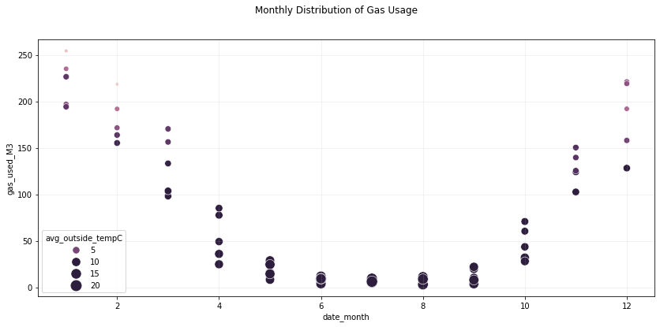
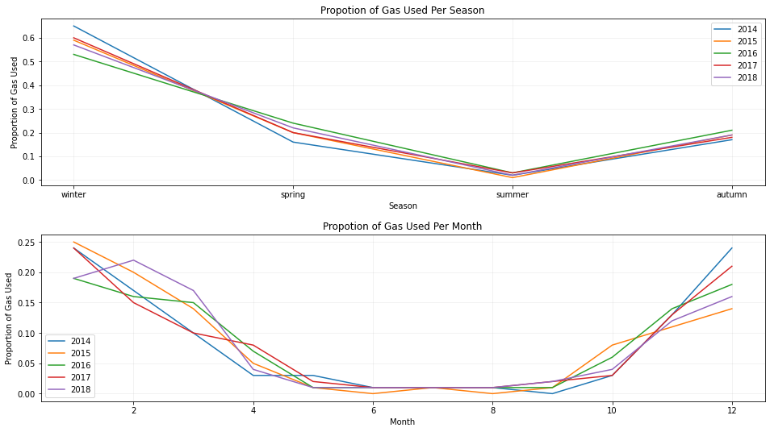

# Household Gas Usage Forecast & Optimisation App
## Introduction
No one likes the surprise of opening their latest energy bill to find that the cost is increasing because the latest energy readings show a rise in consumption. This all being a common scenario, but if we can leverage the data of our past gas consumption then we can gain the ability to stay on top of the amount of future gas we use (providing the non occurence of black swan events), therefore no nasty surprises in the post. Furthermore if we utilise the future gas forecast to enable us to apply a cost threshold to the amount of gas we consume, we can then have the ability to cut the costs and amount of gas we use bringing energy bills down and also doing our bit for the environment.

### Project Summary
With the above in mind the idea behind this project was to forecast future household gas consumption for central heating from previous household gas usage data, and create an optimisation app which utilises the usage pattern from the future forecast to provide the homeowner the ability to apply a cost threshold to their gas consumption in order to have more control and aid in keeping household energy bills down. We aimed to achieve future gas forecasts via the use of time series modelling and also converting the time series problem into a normal regression problem so that linear/non-linear and tree models could also be used, with the performance metric of choice being RMSE as the data showed no presence of outliers. We found using a simple model of best feature produced a baseline RMSE score of approx. 22 but using the monthly average gas consumption as a baseline produced a better RMSE score of approx. 18. The best performing model was a gradient boosting model that was trained on the converted time series data obtaining an RMSE score of approx. 15 with a difference of £2.68 between actual and forecast gas consumption.

## Dataset
The data were obtained online from kaggle and were in SQL format, the data provided household energy readings, exterior temperature and interior temperature readings from 2013 up until 2019 with a total of over 1.5 million readings. As the readings were recorded sequentially the singular readings (e.g. electricuty consumption, gas consumption, room temps, outside temp) were extracted in SQL to create seperate datasets of each reading source so that the correct data could be acquired, then using pandas the data were aggregated to average monthly temperature readings and total gas consumption bringing the data down to a total of 62 observations. The time series data consisted of the datetime feature as the index with the total monthy gas consumption as feature, for modelling the time series data as a regression problem lag features for gas consumption were engineered aswell as extracting month and year from the datetime feature also season, average outside temperature and the cyclical nature of season and month using their sin and cosine were initially included.

*include initial data heads for time series data and regression data*

## Preprocessing // Feature Engineering
The data contained no missing values, errornous observations or duplicate observations, outliers were detected using the interquatile range and for the majority of the data no outliers were detected, outliers that were found belonged to redundant features and were consequently removed.
The types of features engineered in modelling as a regression problem were; average features, lag features, rolling means, expanding means, power features, k nearest neighbour local prediction, interaction features, ratio features, sin/cosine features.

*include head of regression data after feature engineering*

## EDA
As could be expected seasonality has high impact on the amount of gas used for central heating this is mostly due to the temperature for the time of year, with winter months being the coldest and seeing more gas used compared to summer months being the hottest with little gas used. Figures 1, 2 & 3 show the interaction of seasonal/monthly temperature and gas usage.

*Figures 1 & 2*

As can be seen summer occupies the low range of gas usage whilst winter occupies the high range of gas usage, spring and autumn have a fairly similar spread.

*Fig. 3*

Increasing the granularity with monthly temperature interactions we can see that summer months (jun,jul,aug) have roughly the same gas usage and outside temperature, winter months (jan,feb,dec) have a slightly wider spread of gas usage with january averaging the highest gas usage. With spring (mar,apr,may) & autumn (sep,oct,nov) we can clarify a slightly wider spread on usage for spring months which could be due to winter preceeding spring. We can also see that the lower the outside temperature the higher the gas usage and vise versa which makes sense.

Figures 4 & 5 show the proportion of gas used per season and per month, which shows gas usage is fairly consistent across seasons and for monthly proportions there seems to be some variability between february and march. This appears to be due to colder temperatures, 2017: feb-march = 5.78-9.32 degrees, 2018: feb-march = 0.08-5.49 degrees.

*Figures 4 & 5*

From visual inspection no features appear to be normally distributed and this was confirmed via the use of qqplots, this could also be due to such a small sample size. A statistical test for normality was also implemented with no features appearing to be normally distributed, although some tests were affected by the sample size. For correlation and association testing as normal distributions were not present among the measured continuous and discrete continuous features spearmans rho coefficient will be used for measured/discrete/combintaion correlation analysis. For measured/discrete and nominal feature associations the correlation ratio will be used as it uses the levels of the nominal feature to determine relationship strength, For nominal/nominal relationships theils u coefficient will be used. After Feature engineering we found multicollinearity was present amongst features which means dimensionality reduction via pca might be a consideration for non-tree models, features with minimal to no correlation/association with the target were dropped. Statistical significance tests between features and target were performed to establish if their relationship is significant, where Ho = feature/target relationship likely to have occured by chance, Ha = feature/target relationship not likely to have occured bu chance, signifance level = 5% and confidence level of 95%. Significance suggests that the relationship between feature and target (if there is one) is not likely to have occured by chance, non-significance suggests the relationship (if there is one) is likely to have occured by chance. Measured features tested using spearmans rho test, discrete features tested using kruskall-wallis test and nominal features also tested with kruskall-wallis test. The majority of features appeared to have statistically significant relationships with the target gas used, Features with non-significant relationships were dropped as their relationships are likely to have occured by chance and therefore may effect generalisation on new data. After analysis we found the top features to be month_sin, month_cos, exp_mean_ratio_outsidetemp_gas_used, exp_mean_ratio_housetemp_gas_used, knn_local_knowledge, as multicollinearity was still present we found that we could retain approx. 99% variance with only two components and dimensionality reduction via pca would be used for non-tree models. 

## Baseline
As we have no outliers present in the data RMSE will be a good performance metric to evaluate our models with.

## Modelling

## Results

## Conclusion

## Future Improvements
